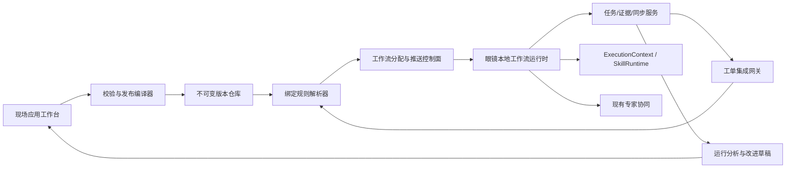

# V9 企业现场应用与可配置工作流设计

文档日期：2026-08-01

状态：已根据用户对竞品编辑器、工单绑定、自动推送和眼镜呈现方式的连续确认形成实施基线。

## 1. 产品目标

V9 对外提供“企业 AI 现场应用平台”，让企业无需重新开发或安装 APK，即可把自己的 SOP、工单字段、证据要求、AI Skill、知识和专家协同组合成眼镜现场应用，审核发布后自动推送到授权眼镜。

工作流是现场应用的执行引擎，不是产品的全部。一个 `field_app` 由以下部分组成：

- 应用名称、入口、适用范围和权限。
- 一个或多个工作流及其不可变版本。
- 固定 HUD 页面模板和类型化字段。
- AI Skill、知识范围和项目记忆策略。
- 工单输入、结果输出和服务端连接器映射。
- 发布、分配、自动推送、灰度、回滚和审计策略。

## 2. 不可破坏边界

- 不改变现有眼镜首页、HUD 风格、布局比例、按钮位置、Camera2、语音、AI 对话和专家协同主链路。
- 不下发 HTML、JavaScript、原生代码、任意表达式、任意 URL 或任意 HTTP 请求。
- 不在工作流、APK、网页 bundle、日志或推送消息中保存 MVS/CMMS 密码、长期 token、管理员 token或供应商密钥。
- AI 只能生成草稿、建议和受控结果，不能自动接单、提交、推进高风险节点、完成或关闭任务。
- 发布工作流不能声明设备不具备的能力；不兼容时在发布或分配阶段明确拒绝。
- 自动推送不等于自动执行。工单接单、开始、外部提交、完成和关闭仍遵循权限及二次确认。

## 3. 端云架构

网页保存可编辑草稿图；发布编译器将其转换为规范化、带摘要和签名的 `execution_package`。眼镜只执行发布包，不解释编辑器内部对象。

## 4. 核心领域对象

### 4.1 `field_app`

企业面向现场人员发布的应用容器，保存组织、名称、说明、图标引用、入口模式、状态和默认工作流。独立应用从既有能力中心进入；工单绑定应用从维修工单详情进入。

### 4.2 `workflow_definition` 与 `workflow_version`

- `workflow_definition` 是可持续迭代的逻辑身份。
- 草稿可编辑；发布生成不可变 `workflow_version`、连续版本号、schema 版本、内容摘要、签名、最小客户端版本和所需能力清单。
- 生命周期：`draft -> validating -> review_pending -> published -> deprecated -> archived`。校验或审核失败回到草稿并保留原因。
- 正在执行的任务固定版本；普通弃用不影响活跃执行，安全撤销可将相关执行置为 `blocked` 并给出恢复动作。

### 4.3 `workflow_binding_rule` 与 `workflow_assignment`

绑定规则根据组织、外部系统、客户、项目、工单类型、资产类别/品牌/型号、故障类型、优先级、风险、标签和有效时间匹配工作流。

每张工单的模式只能是：

- `required`：必须执行指定工作流，完成门禁由工作流决定。
- `optional`：执行包提前推送，现场人员选择标准流程或普通任务。
- `none`：不使用工作流，完整保留现有 V9 项目、AI、相机和专家链路。

解析优先级固定为：工单人工指定 > 外部系统受信映射 > 客户/项目规则 > 资产/工单类型规则 > 组织默认规则 > `none`。同优先级且同具体度冲突时拒绝自动分配，不静默任选。

分配始终保存精确的 `workflow_version_id`、来源、命中规则、操作者/系统身份和解析证据。未开始工单可经审计重新绑定；开始后不得原地换版。

### 4.4 `workflow_execution` 与 `workflow_step_execution`

执行实例关联组织、工单、项目、任务、工作流版本、人员和设备。工作流状态至少支持：

`not_started -> active -> paused|waiting_network|waiting_expert|blocked -> completed|cancelled`

步骤状态至少支持：

`pending -> active -> draft_saved|waiting_upload|waiting_server -> completed|skipped|failed`

每次转移记录前序状态、目标状态、节点、操作者、设备、时间、幂等键、输入摘要、证据引用和规则结果。

## 5. 受控工作流 DSL

### 5.1 首发节点白名单

- `start`、`instruction`、`choice`、`form`。
- `photo_capture`、`video_capture`、`voice_input`。
- `ai_assist`、`expert_call`、`confirmation`。
- `condition`、`repeat_group`、`subflow`。
- `connector_action`、`complete`。

条件表达式只支持类型化字段和白名单操作符：`eq`、`neq`、`in`、`contains`、`exists`、`gt`、`gte`、`lt`、`lte`、`all`、`any`、`not`。禁止动态求值、脚本、正则执行和访问未声明变量。

工作流图默认为有向无环图。重复采集只能使用带 `maxIterations` 的 `repeat_group`；子流程在发布时锁定并编译为精确版本，禁止运行时递归。

### 5.2 节点共同合同

每个节点包含稳定 `nodeId`、类型、标题、说明、页面模板、输入/输出 schema、必填规则、允许动作、转移、离线策略、超时、重试、风险等级和可观测标签。

节点不得保存连接器凭据。`connector_action` 只能引用平台已审核的 `connectorId/actionId` 和类型化参数映射；写操作标记为高风险并要求现场二次确认及服务端再次授权。

## 6. 固定 HUD 页面系统

网页端不是任意 UI 设计器，而是固定模板的内容与动作配置器。首发模板包括：

- `instruction`：说明、参考图、风险提示。
- `evidence_capture`：相机/录像、要求、计数、重拍和确认。
- `form`：适合眼镜的单字段或短列表填写。
- `choice`：大面积单选/多选。
- `conversation`：现有全屏任务对话和 AI 回复分页。
- `confirmation`：动作摘要、影响、确认和取消。
- `completion`：步骤、证据、风险、同步和回写摘要。

模板只允许配置标题、内容、字段、参考资料、可见动作、必填条件和语音提示。布局、主要操作区和现有 HUD 视觉保持冻结。

眼镜呈现路径为：现有首页 -> 三道杠/能力中心 -> 维修工单或现场应用 -> 列表 -> 详情 -> 工作流步骤 HUD -> 结束摘要。收到推送时不抢占当前页面，只显示轻提示并后台准备。

## 7. 自动推送协议

### 7.1 用户体验

V9 APK 只安装一次。管理员发布并绑定后，工作流无需人工下载、文件导入或 APK 更新，自动到达授权眼镜并缓存。

### 7.2 传输语义

为保证可靠性和安全，推送事件只携带 `assignmentId`、版本、序列号和摘要，不携带完整执行包或凭据。眼镜收到事件后使用 15 分钟短期设备会话后台拉取完整包、校验并确认送达；这在产品上属于自动推送，用户无下载操作。

推送控制面使用可替换 `WorkflowPushTransport`：在线控制通道负责低延迟提示，设备同步游标负责断线补偿。Air3 首发传输必须经过后台存活、耗电和中国网络环境实测后确定，不依赖未经验证的 GMS。

分配状态：`queued -> notified -> delivered -> verified -> ready -> active -> completed`，以及 `failed|revoked`。服务端保存单调序列，设备按游标补齐遗漏事件；重复通知不产生重复分配。

### 7.3 执行包

执行包至少包含：

- schema、应用、工作流和不可变版本标识。
- 组织/分配范围、发布时间、内容摘要和签名。
- 最小 V9 版本及 `requiredCapabilities`。
- 规范化节点、转移、类型化变量和页面模板配置。
- Skill/知识的版本引用，不包含服务端高权限 Prompt。
- 内容寻址的参考资料清单，不包含第三方凭据或任意 URL。

设备必须先验证组织、分配对象、摘要、签名、schema、版本和能力，再原子替换本地缓存。失败保留上一份仍有效的缓存，并向管理端回报明确阶段。

## 8. Android 本地执行

`WorkflowRuntime` 由以下独立组件组成：

- `WorkflowPackageStore`：原子保存已验证执行包和执行快照。
- `WorkflowValidator`：验证 schema、签名、图结构和能力。
- `WorkflowStateMachine`：确定性选择当前节点和下一转移。
- `WorkflowCapabilityRegistry`：把节点映射到现有 Camera2、录像、语音、AI、专家和任务能力。
- `WorkflowEvidenceGate`：检查本地可靠保存、数量、类型和人工确认。
- `WorkflowSyncReporter`：复用持久化 outbox 上报步骤和分配状态。

普通步骤从本地快照推进，不等待网络。照片、视频和表单先本地可靠保存；允许离线的节点在本地证据满足后继续，最终外部提交必须等待服务端确认。`ai_assist`、`expert_call` 和 `connector_action` 在离线时进入明确的 `waiting_network`，不伪造结果。

## 9. AI、Skill、知识和记忆

`ai_assist` 节点只能引用已发布并授权的 Skill/知识版本。服务端每轮构建 `ExecutionContext`，包含工单、项目摘要、当前工作流/节点、事实、最近对话、本轮证据、项目指令和授权引用。

AI 输出经过节点 schema 和安全策略验证，只能填充草稿、显示建议或提出分支建议。确定性状态机和现场人员决定步骤推进。用户确认的未来规则写入项目记忆；跨项目不自动继承。完成案例只能生成知识/Skill/工作流改进草稿，必须审核发布。

## 10. 管理网页

现场应用工作台沿用现有白、雾灰、绿色运维工作台视觉和高信息密度布局：

- 左侧：应用、工作流、节点和版本列表。
- 中央：图形流程画布或 Air3 模板预览。
- 右侧：选中节点的类型化属性、验证和权限。
- 顶部：保存、模拟、提交审核、发布、灰度和回滚。

提供样例工单模拟、成功/异常/离线路径、未连通节点、不可达节点、冲突分支、缺少结束节点、能力不兼容、未授权 Skill、危险连接器和秘密模式检查。正式发布必须保存验证报告和审核身份。

## 11. 工单和连接器闭环

MVS/CMMS/EAM 只通过我方 HTTPS 网关接入。网关把外部 DTO 转换为内部轻量工单并触发绑定解析；外部系统可传受控工作流代码，但服务端只能映射到本组织允许的内部定义。

任务结束后先生成本地和云端摘要。接单、签到签退、表单提交、流程推进、完成和关闭等外部写操作要求明确二次确认、幂等键、字段白名单和审计。AI 只能生成回写草稿。外部系统没有对应 API 时记录 `unsupported`，不得假装回写成功。

## 12. 权限、安全和审计

- `super_admin` 管理组织策略、连接器和发布治理。
- `ops_admin` 在授权项目内设计、测试、审核和分配。
- 可选四眼规则禁止同一人发布高风险或新连接器版本。
- `field_engineer` 只执行已分配工作流；`remote_expert` 和 `viewer` 只读取受邀/授权范围。
- 所有查询、版本、分配、执行包和证据按组织与项目 RLS/服务端范围过滤。
- 草稿导入、SOP、外部工单、图片文字和模型输出均视为不可信输入。

## 13. 性能和可靠性门槛

- 在线且设备可达时，分配到设备收到提示目标 p95 不超过 5 秒；该数字必须以真实 Air3/云端证据验证后才能对外承诺。
- 已缓存执行包的普通节点切换 p95 小于 100ms，且不在 UI 线程执行网络、媒体编码或 JSON 大文件解析。
- 工作流包默认上限 256KB；参考图片/视频单独内容寻址和预取。
- 工作流执行不得让相机启动、语音首反馈、AI 首 token、专家通话、温升、耗电、掉帧、crash 或 ANR 超过既定 V9 非回归门槛。
- 断网、进程终止和设备重启后不得丢当前节点、草稿、证据或待发事件。

## 14. 验收用例

1. 发布“收货照片 -> 铭牌 -> 配置页面 -> AI 检查 -> 确认结束”流程并自动推送，眼镜无需更新 APK即可执行。
2. 同一组织的 `required`、`optional`、`none` 三张工单分别进入强制流程、用户选择和现有普通任务链路。
3. 两条规则同优先级冲突时工单进入待处理，不错误分配。
4. 已开始任务继续使用旧版本；新工单绑定新发布版本；回滚不改历史执行。
5. 断网拍照、填写和推进允许离线的节点，重启后恢复并联网补传。
6. 缺少必填照片、表单或人工确认时无法完成；AI 建议不能绕过门禁。
7. 不支持的节点、错误签名、跨组织分配、撤销设备和过期短期会话均被拒绝。
8. 专家从具体节点进入，退出回到原项目、原任务和原步骤。
9. 外部写入未确认、接口不存在或网关失败时保留草稿并显示真实状态。
10. 工作流接收和执行不改变现有首页、HUD、Camera2、双语音和专家协同非回归结果。

## 15. 实施顺序

1. DSL、图校验、版本发布编译和数据库合同。
2. 管理与设备 API、工单绑定解析、分配游标和审计。
3. 管理网页的流程编排、模板预览、模拟和发布。
4. Android 包验证、缓存、状态机、能力注册、证据门禁和恢复。
5. 自动推送控制通道、弱网补偿和设备状态回报。
6. SkillRuntime、知识、项目记忆和工作流 AI 节点联动。
7. MVS 连接器映射、受控回写和端到端试点。
8. 安全、性能、长稳、Air3、云端和正式发布验收。
